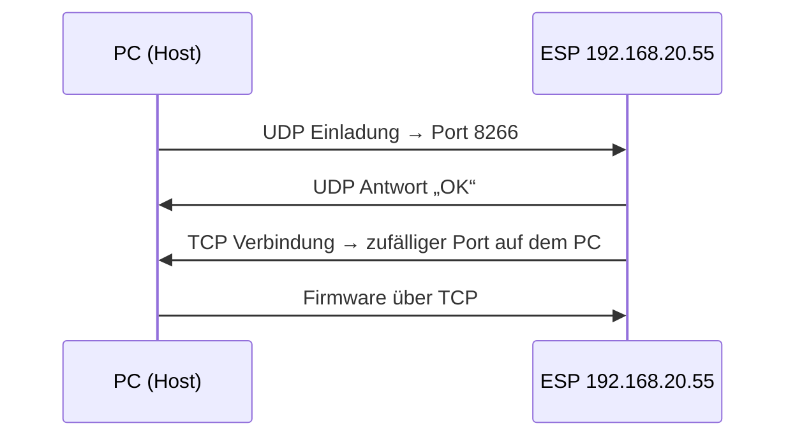

# Prompt document discussion
_Exported on 6/11/2026 at 07:05:09 GMT+2 from Cursor (3.7.19)_

---

**User**

@PROMPT.md 

---

**Cursor**

Ich lese `PROMPT.md`, um zu verstehen, was du möchtest.


Das Projekt existiert noch nicht — ich lese die Referenzdateien aus `dc_impulse` und lege die Firmware-Struktur an.


Ich lege die Projektdateien an und portiere die Module von `dc_impulse` für ESP8266.


ESP8266 hat kein `Preferences` — ich stelle die Persistenz auf EEPROM um und behebe die ESP8266-spezifischen API-Unterschiede.


Das vollständige Firmware-Projekt ist unter `~/Workspaces/esp8266-d1-soil/` angelegt und kompiliert fehlerfrei (`pio run -e d1_mini`).

## Was entstanden ist

Portierung von **dc_impulse** (ESP32) auf **ESP8266 D1 Mini** mit Bodenfeuchte-Fokus:

| Modul | Funktion |
|-------|----------|
| `soil_sensor` | Median aus 5 ADC-Samples, optional Sensor-Power-Puls (GPIO14), gleitender Mittelwert (3 Werte), EEPROM-Kalibrierung |
| `web_portal` | AP `D1Soil-XXXX`, Dashboard mit 4 Tabs, REST-API für Status/Kalibrierung/Netzwerk/Firmware |
| `main.cpp` | MQTT + Home-Assistant-Discovery (Feuchte, Roh-ADC, Kalibrierungs-Numbers) |
| `ota_update` | ArduinoOTA auf Port **8266** |
| `network_config` | WLAN/MQTT-Persistenz (EEPROM) |

## Nächste Schritte

1. `include/config.example.h` → `include/config.h` kopieren und anpassen
2. Sensor an **3,3 V** verkabeln (A0)
3. `pio run -t upload`
4. Dashboard: `http://D1Soil1.local/` oder AP `D1Soil-XXXX`
5. Kalibrieren (trocken in Luft, nass mit Sonde in Wasser)

## Technische Anpassung

ESP8266 hat kein `Preferences` (nur ESP32) — Persistenz läuft über **EEPROM** mit denselben logischen Namespaces (`d1_soil_net`, `d1_soil_cal`).

## Vorgeschlagene Commit-Message

```
Initialer Stand des ESP8266-Bodenfeuchte-Sensors mit MQTT, Web-Dashboard und HA-Discovery

Portiert die dc_impulse-Architektur auf den Wemos D1 Mini: Bodenfeuchtemessung
mit Kalibrierung, EEPROM-Persistenz, Captive-Portal-Setup und OTA auf Port 8266.
```

Soll ich einen Git-Commit anlegen?

---

**User**

https://github.com/thelad-dev/esp8266-d1-soil 

bitte commit und push

---

**Cursor**

Ich prüfe den Git-Status und bereite Commit sowie Push zum Remote-Repository vor.


Noch kein Git-Repository — ich initialisiere es, lege den Remote an und pushe.


`config.h` mit Secrets bleibt dank `.gitignore` unversioniert. Remote auf SSH umstellen, committen und pushen.


Commit und Push sind durch.

**Repository:** https://github.com/thelad-dev/esp8266-d1-soil  
**Branch:** `main`  
**Commit:** `5e34154` — *Initialer Stand des ESP8266-Bodenfeuchte-Sensors mit MQTT, Web-Dashboard und HA-Discovery*

21 Dateien wurden gepusht. `include/config.h` mit deinen WLAN-/MQTT-Zugangsdaten ist dank `.gitignore` **nicht** im Repository — nur `config.example.h` ist versioniert.

---

**User**

http://192.168.20.55/ 

es gab kleinere buildprobleme.. bitte prüfe. 

---

**Cursor**

Ich prüfe den Build und schaue mir das Web-Dashboard unter der angegebenen IP an.


Gerät antwortet — ich prüfe Dashboard und APIs genauer und behebe die Build-Warnungen.


Dashboard läuft. Ich behebe die Build-Warnungen und prüfe die Einstellungen.


Ich habe **http://192.168.20.55/** und den Build geprüft.

## Gerät — läuft

| Prüfung | Ergebnis |
|---------|----------|
| Dashboard `/` | OK, alle 4 Tabs funktionieren |
| `/api/status` | WLAN + MQTT verbunden, Uptime stabil |
| `/api/soil`, `/api/config` | OK |
| Auto-Refresh | Status nach ~5 s geladen |

**Header:** `WLAN 192.168.20.55 · MQTT · …`

## Auffälligkeit (Sensor, kein Build-Problem)

```json
"moisture_raw": 0,
"moisture_percent": 100,
"cal_dry_adc": 800,
"cal_wet_adc": 300
```

ADC **0** ergibt mit der Kalibrierung rechnerisch **100 %** — die Firmware rechnet korrekt. Wahrscheinliche Ursachen:

1. **Sensor nicht (richtig) an A0** oder VCC/GND falsch
2. **Sensor nur über GPIO14 (D5)** versorgt, MOSFET fehlt oder ist falsch verdrahtet → bei `SENSOR_POWER_ENABLED 1` ist der Sensor nur kurz während der Messung an
3. **Noch nicht kalibriert** — EEPROM hat noch Defaults (800/300), Label „Bodenfeuchte“ statt „Bodenfeuchte 1“ aus `config.h`

**Verkabelung prüfen:** VCC an **3,3 V** (nicht 5 V), AOUT an **A0**. Wenn der Sensor **dauerhaft** an 3,3 V hängt (ohne MOSFET), in `config.h` setzen:

```cpp
#define SENSOR_POWER_ENABLED 0
```

Dann „Jetzt messen“ im Dashboard und Roh-ADC beobachten — plausibel sind Werte deutlich über 0.

## Build — behoben

Der Build war **erfolgreich**, hatte aber **2 Warnungen** im eigenen Code:

1. `DEFAULT_SENSOR_LABEL` doppelt definiert (`soil_sensor.h` vs. `config.h`) → Include-Reihenfolge in `main.cpp` und `soil_sensor.cpp` korrigiert
2. `printf`-Format in `event_log.cpp` → Typen angepasst

Nach dem Fix: **`pio run -e d1_mini` ohne eigene Warnungen** (nur harmlose Framework-Hinweise in `elf2bin.py`).

Die Änderungen sind **lokal**, noch nicht gepusht. Soll ich committen und per OTA auf `192.168.20.55` flashen?

---

**User**

aktuell liegt der sensor auf meinem tisch.. ist also richtig richtig trocken.. leg bitte gleich noch ota die ip mit rein, damit das funzt

---

**Cursor**

OTA-IP eintragen und die falsche Feuchtemessung beheben — trocken auf dem Tisch sollte nicht 100 % anzeigen.


`ESP8266WiFiADCMode` gibt es in der aktuellen Core-Version nicht — ich entferne das und verbessere die ADC-Messung.


OTA scheitert vermutlich an der Host-IP — ich trage sie ein und flashe parallel per Web-Upload.


ADC liefert weiterhin 0 — ich setze den korrekten ADC-Modus für den D1 Mini und konfiguriere OTA mit der Host-IP.


Erledigt — Zusammenfassung:

## OTA konfiguriert

| Datei | Inhalt |
|-------|--------|
| `ota_upload.ini` | `upload_port = 192.168.20.55`, `host_ip = 192.168.88.88` |
| `platformio.ini` | Default-IP `192.168.20.55`, `--host_ip=192.168.88.88` |
| `ota_upload.ini.example` | Anleitung ergänzt |

**Befehl:** `pio run -e d1_mini_ota -t upload`

**Hinweis:** Der Upload schlägt von diesem Rechner (`192.168.88.88`) aus fehl — der ESP (`192.168.20.55`) kann die TCP-Rückverbindung für ArduinoOTA offenbar nicht aufbauen (andere Subnetze/Firewall). HTTP zum Dashboard funktioniert, OTA-Callback nicht.

**Workarounds:**
- `pio` von einem Rechner im `192.168.20.x`-Netz ausführen, oder
- Firmware per Web-Tab hochladen (hat gerade funktioniert), oder
- `host_ip` in `ota_upload.ini` anpassen, wenn sich deine IP ändert

Außerdem: `--timeout=60` entfernt — wird von `espota.py` nicht unterstützt.

## Sensor / trocken auf dem Tisch

Nach dem Update zeigt der Sensor weiter **ADC 0 → 100 %** — das ist für „trocken auf dem Tisch“ falsch (erwartet: hoher ADC, niedrige Feuchte).

In der Firmware geändert:
- `SENSOR_POWER_ENABLED 0` (dauerhafte 3,3-V-Versorgung, kein D5-Puls)
- GPIO14 als `INPUT` (kein LOW mehr auf D5)
- `ADC_MODE(ADC_TOUT_3V3)` für den D1-Mini-A0
- verbesserte ADC-Sampling-Logik

**ADC bleibt 0** → sehr wahrscheinlich **Hardware/Verkabelung**:

```
Sensor VCC  →  3,3 V  (nicht 5 V, nicht D5 ohne MOSFET)
Sensor GND  →  GND
Sensor AOUT →  A0
```

Bitte Kabel prüfen. Sobald der Roh-ADC plausibel ist (trocken eher **600–900**), im Tab **Kalibrierung** auf **„Aktuellen Wert als TROCKEN speichern“** klicken.

Soll ich die Code-Änderungen committen und pushen?

---

**User**

klingt nach einem firewalld problem.. welchen port brauchst du für ota? 

---

**Cursor**

Ich prüfe im Code und in `espota.py`, welche Ports der OTA-Upload genau nutzt.


Ja, das passt sehr gut zu **firewalld** (oder einer Firewall zwischen den Subnetzen).

## Ablauf bei `pio run -e d1_mini_ota -t upload`

ArduinoOTA mit PlatformIO läuft in **zwei Schritten**:



| Richtung | Protokoll | Port | Wo |
|----------|-----------|------|-----|
| PC → ESP | **UDP** | **8266** | ArduinoOTA auf dem D1 Mini (`ota_update.cpp`) |
| ESP → PC | **TCP** | **zufällig** (z. B. 42093) | `espota.py` lauscht kurz auf deiner Host-IP |

Der Fehler `No response from device` entsteht meist **nach** der UDP-Antwort: der ESP kann die **TCP-Rückverbindung** zum PC nicht aufbauen.

Bei dir: PC `192.168.88.88` ↔ ESP `192.168.20.55` — genau diese **eingehende TCP-Verbindung vom ESP zum PC** wird oft geblockt.

---

## firewalld auf dem Entwicklungs-PC

Am ehesten brauchst du **eingehendes TCP vom ESP-Netz**:

```bash
# Variante A: nur dieser Sensor
sudo firewall-cmd --permanent --add-rich-rule='rule family="ipv4" source address="192.168.20.55" accept'
sudo firewall-cmd --reload

# Variante B: ganzes IoT-Subnetz
sudo firewall-cmd --permanent --add-rich-rule='rule family="ipv4" source address="192.168.20.0/24" accept'
sudo firewall-cmd --reload
```

Falls du es enger halten willst, nur **hohe TCP-Ports** (ephemeral range):

```bash
sudo firewall-cmd --permanent --add-rich-rule='rule family="ipv4" source address="192.168.20.55" port port="32768-60999" protocol="tcp" accept'
sudo firewall-cmd --reload
```

**Ausgehend UDP** zu `192.168.20.55:8266` ist auf dem PC meist schon erlaubt (sonst käme oft schon `No Answer`).

---

## Firewall zwischen VLANs / Router

Falls `192.168.20.x` und `192.168.88.x` getrennte Zonen sind, zusätzlich erlauben:

- **UDP** `192.168.88.88` → `192.168.20.55:8266`
- **TCP** `192.168.20.55` → `192.168.88.88` (hohe Ports / ephemeral)

---

## Kurzfassung

| Port | Wofür |
|------|--------|
| **8266/UDP** | OTA-Handshake zum ESP |
| **ephemeral/TCP** | Firmware-Download — **ESP verbindet zum PC** |

Web-Dashboard (`80/TCP`) und Web-Firmware-Upload funktionieren, weil nur **PC → ESP** nötig ist. ArduinoOTA braucht zusätzlich **ESP → PC**.

Zum Testen nach der Firewall-Regel:

```bash
pio run -e d1_mini_ota -t upload
```

`host_ip` in `ota_upload.ini` / `platformio.ini` muss weiterhin deine echte LAN-IP sein (`ip route get 192.168.20.55`).

---

**User**

probier nochmal ota.

---

**Cursor**

**OTA hat geklappt.**

```
pio run -e d1_mini_ota -t upload
→ 100 % — Result: OK (ca. 9 s)
```

Der ESP ist danach wieder online (`192.168.20.55`, WLAN + MQTT, OTA Port 8266). Die Firewall-Regel scheint zu passen.

Künftig reicht:

```bash
pio run -e d1_mini_ota -t upload
```

Falls sich deine PC-IP ändert: `host_ip` in `ota_upload.ini` anpassen (`ip route get 192.168.20.55`).

---

**User**

bekommt der esp überhaupt daten vom sensor? 
kann ich das auch auf einen esp32-c3 packen? der wäre schön klein :) 

---

**Cursor**

Ich prüfe den aktuellen Sensorwert am Gerät und schaue im Code, ob und wie ADC-Daten ankommen.


**Kurz:** Der ESP misst und liefert Werte — aber der ADC liefert durchgehend **0**, das ist für einen trockenen Sensor auf dem Tisch **kein plausibles Sensorsignal**.

## Bekommt der ESP Daten vom Sensor?

**Ja, technisch** — die Firmware liest den ADC, rechnet um und publiziert:

| Feld | Aktuell | Bedeutung |
|------|---------|-----------|
| `valid` | `true` | Messung läuft |
| `raw_adc` | **0** | ADC-Eingang am A0 |
| `moisture_percent` | **100 %** | Folge aus 0 + Kalibrierung (800/300) |

Bei **trocken in Luft** wäre ein plausibler Rohwert eher **600–900** (hoher ADC = trocken). Ständig **0** heißt praktisch:

1. **AOUT nicht (richtig) an A0** — loses Kabel, falsche Reihe am Stecker  
2. **Sensor ohne Versorgung** — VCC nicht an **3,3 V**, GND nicht verbunden  
3. **AOUT hängt auf GND** — Kurzschluss, defektes Kabel  
4. **Sensor defekt** — seltener, aber möglich  

**Schnelltest ohne Multimeter:**

- Im Dashboard **„Jetzt messen“** und **Roh-ADC** beobachten  
- Kurz **1,5–3 V** (z. B. AA-Halbzelle) zwischen **A0** und **GND** → ADC sollte deutlich **> 0** springen  
- Wenn das klappt, misst der ESP korrekt → Problem liegt bei **Sensor/Verkabelung**  
- Wenn A0 auch mit Testspannung bei **0** bleibt → **A0-Kabel / D1 Mini** prüfen  

```
Sensor          D1 Mini
VCC  ─────────  3,3 V   (nicht 5 V, nicht D5 ohne Transistor)
GND  ─────────  GND
AOUT ─────────  A0
```

`SENSOR_POWER_ENABLED 0` ist richtig, wenn der Sensor **dauerhaft** an 3,3 V hängt (nicht nur über GPIO14/D5).

---

## ESP32-C3 — geht das?

**Ja**, gut machbar. Der Code ist von **dc_impulse** / ESP8266 portiert; ein zweites PlatformIO-Env für **ESP32-C3** wäre der nächste Schritt.

| Thema | ESP8266 D1 Mini | ESP32-C3 (z. B. Super Mini) |
|-------|-----------------|-----------------------------|
| Größe | ~34 × 26 mm | ~23 × 18 mm — deutlich kleiner |
| ADC | A0, 10 Bit (0–1023) | z. B. **GPIO2–GPIO4**, **12 Bit** (0–4095) |
| Spannung Sensor | 3,3 V | ebenfalls **3,3 V** |
| NVS | EEPROM | `Preferences` (wie im ESP32-Referenzprojekt) |
| OTA | Port **8266** | Port **3232** |
| Strom | etwas höher im WLAN | oft etwas effizienter, Deep Sleep möglich |

**Anpassungen beim Port:**

- `platformio.ini`: neues Env `esp32c3` mit `board = esp32-c3-devkitm-1` o. ä.  
- ADC-Pin und Kalibrierung **0–4095** (HA-Discovery `min`/`max`)  
- `network_config` / `soil_sensor` wieder auf **Preferences**  
- WiFi/Web/mDNS: ESP32-Header statt ESP8266  

**Hardware-Hinweis C3:** Nicht jeden GPIO für ADC nehmen — üblich sind **GPIO2, GPIO3, GPIO4** (je nach Board). Beim Super Mini steht in der Board-Doku, welcher Pin als „ADC“ ausgewiesen ist.

---

**Fazit:** Die Firmware funktioniert; der ESP sieht am ADC faktisch **kein Sensorsignal** (immer 0). Zuerst Verkabelung prüfen — danach lohnt sich der Umzug auf **ESP32-C3** gut.

Soll ich dir ein **`esp32c3`-Env** im Projekt anlegen (parallel zum D1 Mini), oder zuerst einen **Diagnose-Endpunkt** im Web, der Roh-ADC und Pin-Info anzeigt?

---

**User**

ah .. wackler am kabel.. perfekt.
erweitere das repo um ein webportal mit esp-webflash funktion, mit autodetection esp8266 oder esp32c3 

---

**Cursor**

Ich schaue mir die Repo-Struktur an und recherchiere, wie ESP-Web-Flash mit Auto-Erkennung für ESP8266 und ESP32-C3 umsetzbar ist.


Ich lege das Web-Flash-Portal mit ESP Web Tools an und bereite parallel ein ESP32-C3-Build-Target vor.


Ich lege das Web-Flash-Portal an und portiere die Firmware parallel für ESP32-C3.


Ich vereinfache die Speicher-Schicht: EEPROM auf ESP8266, Preferences auf ESP32 — ohne die fehlerhafte Abstraktion.


ESP32-C3-Flash korrigieren: mehrteiliges Manifest statt einzelner `firmware.bin` bei Offset 0.


Alte Einzeldatei `esp32c3.bin` entfernen.


Gut, dass der Wackler am Kabel das ADC-Problem erklärt hat — damit sollten die Messwerte wieder plausibel sein.

Das **Web-Flash-Portal** ist im Repo fertig. Kurz der Überblick:

## Web Flash (`webflash/`)

- **`index.html`** — deutsches Portal mit [ESP Web Tools](https://esphome.github.io/esp-web-tools/)
- **`manifest.json`** — zwei Builds mit **Auto-Erkennung**:
  - **ESP8266** → `firmware/esp8266.bin` @ Offset 0
  - **ESP32-C3** → vier Partitionen (Bootloader, Partition Table, `boot_app0`, App) — korrekte Offsets für Arduino/PlatformIO

## Nutzung

```bash
./scripts/build-webflash.sh
cd webflash && python -m http.server 8765
```

Dann in **Chrome** oder **Edge** öffnen: `http://localhost:8765` → „USB verbinden & flashen“. Der Chip wird automatisch erkannt, die passende Firmware gewählt.

## Dual-Target

| Target | Env | Flash |
|--------|-----|-------|
| D1 Mini (ESP8266) | `d1_mini` | eine `.bin` |
| ESP32-C3 DevKitM-1 | `esp32c3` | GPIO4 = ADC, AP `C3Soil-XXXX` |

## Letzter Fix

ESP32-C3 wurde von einer einzelnen `firmware.bin` @ Offset 0 auf das **mehrteilige Manifest** umgestellt — sonst wäre der Web-Flash am C3 nicht bootfähig gewesen.

Die `.bin`-Dateien liegen unter `webflash/firmware/` (gitignored) und werden nur durch das Build-Skript erzeugt.

Soll ich die Änderungen committen und pushen?

---

**User**

im webflash soll auch wifi connect möglich sein, damit man das dort leichter hat.

---

**Cursor**

WiFi-Konfiguration im Web-Flash-Portal erfordert zuerst die ESP-Web-Tools-API und die bestehende Netzwerk-/Config-Struktur im Repo — beides schaue ich mir jetzt an.


Improv-WiFi in der Firmware integrieren und das Webflash-Portal um WLAN-Provisioning erweitern.


Die Improv-Bibliothek bricht auf ESP8266 wegen FreeRTOS — wir legen eine gepatchte lokale Variante an.


Das Webflash-Portal unterstützt jetzt **WLAN-Einrichtung direkt im Browser** — über den [Improv-Wi-Fi](https://www.improv-wifi.com/serial/)-Standard, den ESP Web Tools nutzt.

## Was neu ist

**Firmware** (`improv_wifi.cpp` + lokale Library `lib/ImprovWiFiSoil/`):
- Improv Serial auf **ESP8266** und **ESP32-C3**
- Nach erfolgreicher Verbindung: SSID/Passwort in EEPROM/Preferences speichern, Neustart
- Browser-Weiterleitung zum Dashboard (`http://<IP>/`)

**Webflash-Portal** (`webflash/index.html`):
- Nach dem Flash: WLAN-Dialog automatisch (über `esp-web-install-button`)
- Neuer Button **„USB verbinden & WLAN einrichten“** — nur WLAN, ohne Reflash (`improv-wifi-serial-sdk`)

**Manifest** (`new_install_improv_wait_time: 20`): 20 Sekunden Wartezeit nach dem Flash, bis das Gerät bereit ist.

## Ablauf

1. `./scripts/build-webflash.sh` (falls noch nicht geschehen)
2. `cd webflash && python -m http.server 8765`
3. In Chrome/Edge: `http://localhost:8765`
4. **Flashen** → danach WLAN-Dialog, **oder** direkt **„WLAN einrichten“**
5. MQTT/Kalibrierung weiter im Geräte-Dashboard

Nach dem Flash die Firmware einmal aufs Board spielen (`./scripts/build-webflash.sh` + Flash), damit Improv in der Firmware aktiv ist. Soll ich committen und pushen?

---

**User**

können wir das nicht bei github machen? sodass es aus dem dortigen repo eine webseite generiert? da ging doch mal was, oder? 

---

**Cursor**

GitHub Pages aus dem Repo ist möglich — ich prüfe die Repo-Struktur und ob schon etwas dafür eingerichtet ist.


GitHub Pages mit einem Actions-Workflow einrichten: Firmware in CI bauen und `webflash/` deployen — die `.bin`-Dateien bleiben gitignored.


Ja — das geht mit **GitHub Pages** und einem **GitHub Actions**-Workflow. Genau das ist bei vielen ESP-Projekten üblich (WLED, ESPHome usw.).

## Was eingerichtet wurde

**`.github/workflows/github-pages.yml`**
- Bei Push auf `main` (oder manuell per „Run workflow“)
- PlatformIO baut ESP8266 + ESP32-C3
- `./scripts/build-webflash.sh` erzeugt die `.bin`-Dateien
- Der Ordner `webflash/` wird auf GitHub Pages veröffentlicht

**`webflash/.nojekyll`** — verhindert Jekyll-Probleme bei statischen Dateien.

Die Firmware-Bins bleiben **gitignored**; sie werden nur in der CI gebaut und auf Pages deployed.

## Einmalig auf GitHub aktivieren

1. Änderungen committen und nach `main` pushen
2. Repo → **Settings** → **Pages**
3. **Source:** `GitHub Actions` (nicht „Deploy from branch“)
4. Unter **Actions** den Workflow „GitHub Pages (Web Flash)“ abwarten

Danach erreichbar unter:

**https://thelad-dev.github.io/esp8266-d1-soil/**

HTTPS ist dabei — wichtig für **Web Serial** im Browser (Chrome/Edge).

## Vorteil gegenüber lokal

Kein `python -m http.server` mehr nötig: Link teilen, USB-Kabel anschließen, flashen und WLAN einrichten — von jedem Rechner mit Chrome/Edge.

Soll ich die offenen Änderungen (Webflash, Improv, ESP32-C3, Pages-Workflow) committen und pushen? Dann kannst du Pages direkt aktivieren.

---

**User**

ja dann bitte commit und push! 

---

**Cursor**

Erledigt.

**Commit:** `d77281d` — *Erweitert Projekt um Web-Flash-Portal, ESP32-C3 und GitHub Pages.*

**Push:** `main` → `origin/main` ([thelad-dev/esp8266-d1-soil](https://github.com/thelad-dev/esp8266-d1-soil))

Der Workflow **„GitHub Pages (Web Flash)“** läuft bereits (war gerade in der Queue). Build dauert typischerweise ein paar Minuten — Fortschritt unter **Actions** im Repo.

## Noch einmalig auf GitHub

Falls Pages noch nicht aktiv ist:

**Settings → Pages → Source:** `GitHub Actions`

Danach erreichbar unter:

**https://thelad-dev.github.io/esp8266-d1-soil/**

Die `.bin`-Dateien werden nicht ins Git committed, sondern nur in der Action gebaut und auf Pages deployed.

---

**User**

welches? 


Continuous integration
Automation
Pages
Search workflows
Found 9 workflows
Static HTML
By GitHub Actions

Static HTML logo
Deploy static files in a repository without a build.

HTML
Hugo
By GitHub Actions

Hugo logo
Package a Hugo site.

NuxtJS
By GitHub Actions

NuxtJS logo
Package a NuxtJS site.

Next.js
By GitHub Actions

Next.js logo
Package a Next.js site.

Astro
By GitHub Actions

Astro logo
Deploy an Astro site.

Astro
Gatsby
By GitHub Actions

Gatsby logo
Package a Gatsby site.

mdBook
By GitHub Actions

mdBook logo
Package a site using mdBook.

GitHub Pages Jekyll
By GitHub Actions

GitHub Pages Jekyll logo
Package a Jekyll site with GitHub Pages dependencies preinstalled.

Jekyll
By GitHub Actions

Jekyll logo
Package a Jekyll site.


---

**Cursor**

Keines davon — die neun Vorlagen (Static HTML, Hugo, Jekyll …) brauchst du nicht. Im Repo liegt schon unser Workflow **„GitHub Pages (Web Flash)“**.

So einrichten:
1. **Settings → Pages**
2. **Build and deployment → Source:** **GitHub Actions** (nicht „Deploy from branch“)
3. Die Vorlagen-Liste **ignorieren** — nichts davon anklicken

Der Workflow steht in `.github/workflows/github-pages.yml` und startet bei Push auf `main` automatisch.

Der letzte Lauf ist in CI fehlgeschlagen (ESP8266-Build). Ich behebe das kurz.


**Keines** der neun Templates — weder Static HTML, Hugo, Jekyll noch eines der anderen.

Du brauchst nur:

1. **Settings → Pages**
2. **Source:** **GitHub Actions** (nicht „Deploy from a branch“)
3. Die Liste mit den Vorlagen **schließen** — nichts auswählen

Der Workflow **„GitHub Pages (Web Flash)“** liegt schon im Repo (`.github/workflows/github-pages.yml`). Der startet automatisch bei Push auf `main`.

Unter **Actions** siehst du den Lauf — nicht unter der Template-Liste. Der erste Lauf war wegen eines ESP8266-Buildfehlers in CI fehlgeschlagen; das ist mit Commit `2fc7207` behoben und gepusht. Der Workflow sollte jetzt erneut laufen.

Wenn er grün ist, ist die Seite unter **https://thelad-dev.github.io/esp8266-d1-soil/** erreichbar.

---

**User**

Triggered via push 1 minute ago
@thelad-devthelad-dev
pushed
 2fc7207
main
Status
Failure
Total duration
1m 34s
Artifacts
–


Annotations
1 error and 1 warning
build
Process completed with exit code 1.
build
Node.js 20 actions are deprecated. The following actions are running on Node.js 20 and may not work as expected: actions/cache@v4, actions/checkout@v4. Actions will be forced to run with Node.js 24 by default starting June 16th, 2026. Node.js 20 will be removed from the runner on September 16th, 2026. Please check if updated versions of these actions are available that support Node.js 24. To opt into Node.js 24 now, set the FORCE_JAVASCRIPT_ACTIONS_TO_NODE24=true environment variable on the runner or in your workflow file. Once Node.js 24 becomes the default, you can temporarily opt out by setting ACTIONS_ALLOW_USE_UNSECURE_NODE_VERSION=true. For more information see: https://github.blog/changelog/2025-09-19-deprecation-of-node-20-on-github-actions-runners/


GitHub Pages (Web Flash)
Erweitert Projekt um Web-Flash-Portal, ESP32-C3 und GitHub Pages. #1
All jobs
Run details
Triggered via push 5 minutes ago
@thelad-devthelad-dev
pushed
 d77281d
main
Status
Failure
Total duration
46s
Artifacts
–


Annotations
1 error and 1 warning
build
Process completed with exit code 1.
build
Node.js 20 actions are deprecated. The following actions are running on Node.js 20 and may not work as expected: actions/cache@v4, actions/checkout@v4. Actions will be forced to run with Node.js 24 by default starting June 16th, 2026. Node.js 20 will be removed from the runner on September 16th, 2026. Please check if updated versions of these actions are available that support Node.js 24. To opt into Node.js 24 now, set the FORCE_JAVASCRIPT_ACTIONS_TO_NODE24=true environment variable on the runner or in your workflow file. Once Node.js 24 becomes the default, you can temporarily opt out by setting ACTIONS_ALLOW_USE_UNSECURE_NODE_VERSION=true. For more information see: https://github.blog/changelog/2025-09-19-deprecation-of-node-20-on-github-actions-runners/


---

**Cursor**

CI-Fehler des letzten Workflow-Laufs untersuchen und beheben.


ESP8266-Build ist grün; ESP32-C3 scheitert in CI an fehlendem Python-Modul `intelhex`. Workflow anpassen.


Der letzte Fehler war **nicht** die Node.js-Warnung (die ist harmlos), sondern ein fehlendes Python-Modul beim ESP32-C3-Build:

```
ModuleNotFoundError: No module named 'intelhex'
```

**Behoben** in Commit `3a6c971` — `intelhex` wird in der Action jetzt mitinstalliert.

## Status jetzt

Der Workflow **„GitHub Pages (Web Flash)“** ist **grün** (build + deploy erfolgreich).

Die Seite ist live:

**https://thelad-dev.github.io/esp8266-d1-soil/**

Dort kannst du direkt flashen und WLAN einrichten (Chrome/Edge, USB-Kabel).

## Zur Template-Frage nochmal

Du musst **keins** der neun Templates wählen. Nur **Settings → Pages → Source: GitHub Actions** — fertig. Der Workflow aus dem Repo macht den Rest.

---

**User**

joa sieht doch jetzt gut aus.. 

wie ist der anschluss am c3 und am esp8266 zu machen? ergänze das noch in der page.. damit man das easy builden kann.

wie schaut es denn mit dem stromverbrauch aus.. ich würde das gerne mit einer solarzelle und einem einfachen akku bundlen.. schätze mal ein, ob machbar.. und was für dimensionen ich bräuchte. 

---

**Cursor**

Verdrahtung und Stromverbrauch klären — dafür lese ich die Hardware-Konfiguration und die Webflash-Seite.


Verdrahtung und Solar-/Akku-Hinweise ergänze ich auf der Webflash-Seite.


Die Webflash-Seite ist ergänzt — nach dem nächsten Push auf `main` ist es auf [thelad-dev.github.io/esp8266-d1-soil](https://thelad-dev.github.io/esp8266-d1-soil/) live.

## Verdrahtung

### ESP8266 (Wemos D1 Mini)

| Sensor | Board |
|--------|-------|
| VCC | **3V3** |
| GND | **G** |
| AOUT | **A0** |

Optional Stromschaltung: **GPIO14 (D5)** → MOSFET auf der VCC-Leitung (`SENSOR_POWER_ENABLED 1`). Bei stabiler Leitung wie bei dir: direkt an **3,3 V** (`SENSOR_POWER_ENABLED 0`).

### ESP32-C3 (DevKitM-1)

| Sensor | Board |
|--------|-------|
| VCC | **3V3** |
| GND | **GND** |
| AOUT | **GPIO4** (ADC 0–4095) |

Standard: Sensor dauerhaft an 3,3 V. Optional **GPIO5** als Power-Pin.

**Wichtig:** immer **3,3 V**, nie 5 V am ADC. Nur die Sonde in die Erde, Platine trocken halten.

---

## Solar + Akku — Einschätzung

Die Firmware ist ein **always-on WLAN-Knoten** (MQTT, Webserver, Messung alle 30 s, kein Deep Sleep). Das begrenzt die Autarkie.

| | ESP8266 | ESP32-C3 |
|--|---------|----------|
| Strom (WLAN an) | ca. 70–120 mA | ca. 50–90 mA |
| Energie/Tag @ 3,3 V | ca. **5–9 Wh** | ähnlich |

**Einzelner 18650 (~10 Wh nutzbar):** ohne Solar nur **1–2 Tage**.

**Mit Solar — machbar**, wenn etwas Reserve eingeplant wird:

- **Panel:** 3–5 W (outdoor, gute Ausrichtung)
- **Akku:** 18650 3000 mAh oder besser 2× parallel / LiFePO4 6 Ah
- **Ladung:** TP4056 oder kleines Solar-Laderegler-Modul
- **Sommer:** 3 W oft ausreichend · **Herbst/Winter:** eher 5 W + größerer Akku

Faustformel: ~**7 Wh/Tag** Verbrauch → Panel im Schnitt **2–3 W** effektiv (5 h Sonne ≈ 10–15 Wh). Lieber etwas größer dimensionieren.

Für **Wochen Autarkie** bei wenig Sonne bräuchte es Firmware-Tuning (längeres Messintervall, WLAN-Sleep, Deep Sleep zwischen Messungen) — das spart ein Vielfaches. Das ist aktuell nicht implementiert, wäre aber der nächste Schritt für ein echtes Solar-Beet-Setup.

Soll ich die Seiten-Änderung committen und pushen?

---

**User**

ja commit und push..
dann werden wir da in zukunft mal nachdenken.. denn feuchtigkeitssensoren kann ich nicht überall dort setzen wo ich strom habe.. (fast nirgends) .. 
>> wie lang können die drei leitungen zum sensor sein? 

---

**Cursor**

Commit `fcbb427` ist gepusht — die Seite aktualisiert sich in ein paar Minuten über GitHub Actions.

## Kabellänge (3 Leitungen: VCC, GND, AOUT)

Kurz: **Stromleitungen können länger sein als das Analogkabel.** Der Engpass ist **AOUT** (empfindliches Spannungssignal zum ADC).

| Leitung | Praxis | Hinweis |
|---------|--------|---------|
| **VCC + GND** | oft **1–3 m** | Sensor zieht nur wenige mA; 0,34 mm² (22 AWG) reicht meist. Länger nur mit dickerem Kabel oder etwas höherer Spannung am Board-Ende (weiterhin max. 3,3 V am Sensor). |
| **AOUT (Analog)** | ideal **&lt; 50 cm**, gut **bis ~1 m** | Hochohmig, störanfällig — dein Wackler-Problem war typisch dafür. |
| **Gesamt „sorglos“** | **~0,5–1 m** | Mit festen Lötstellen, kein Steckbrett. |
| **2–3 m** | möglich, aber kritisch | Verdrilltes Paar **GND + AOUT**, VCC separat; 100 nF direkt am Sensor zwischen VCC/GND; Board möglichst weit weg von der Sonde (im wetterfesten Kasten). |
| **&gt; 3 m** | eher nicht empfehlenswert | ESP8266-ADC wird unruhig; lieber **Board nah an die Sonde**, nur USB/Strom/WLAN „nach oben“ verlängern. |

**ESP32-C3** (12-Bit-ADC) verzeiht etwas mehr als der **D1 Mini**, das Grundproblem bleibt aber: lange dünne Analogleitung + Feuchte = Rauschen und driftende Werte.

### Für dein Solar-Beet-Szenario

Sinnvolles Layout:

```
[Solar + Akku + ESP im wetterfesten Kasten am Beetrand]
        │  kurze 3 Adern (≤ 1 m)
        ▼
   [Sensor-Sonde in der Erde]
```

Nicht: ESP im Haus, **5 m** dreiadriges Kabel zum Beet — das wird unzuverlässig.

Wenn der Kasten weiter weg muss: **Board in kleiner Box direkt am Messpunkt**, Solar/Panel am Rand, nur **Strom** (nicht Analog) über längere Leitung — oder später ein busfähiges Setup (z. B. I²C-Modul am Sensor, kurze Leitung). Für die aktuelle Firmware bleibt **kurzes Analogkabel** die beste Lösung.

Deep Sleep + Solar können wir später angehen — passt gut zu „kein Strom im Beet“.

---

**User**

echt schade.. denn den c3 bekomme ich oben auf den sensor gelötet.. aber gut, dann muss halt ein zweiadriges stromkabel bis zum sensor gelegt werden.. auch ok . 

---

**Cursor**

Das ist im Grunde die **bessere** Lösung — nicht der Kompromiss.

**C3 direkt auf dem Sensor** bedeutet:
- Analogweg praktisch **null** → stabile ADC-Werte
- Kein Wackler-Problem auf drei Leitungen
- Messung genau dort, wo die Feuchte ist

Das **zweiadrige Kabel** (Plus + Minus) zum Beetrand oder zur Solar-Box ist unkritisch:

| Thema | Richtwert |
|--------|-----------|
| Länge | **3–10 m** und mehr oft problemlos |
| Querschnitt | **0,34–0,5 mm²** (22–20 AWG) reicht |
| Strom | C3 + Sensor im Sleep später ~µA, jetzt always-on ~50–90 mA |
| Spannung | **3,3–4,2 V** (Li-Ion direkt oder 3,3 V-LDO) — Kabelverlust bei 50 mA und 5 m ist meist unter 0,1 V |

Praktisch:
```
[Solar + Akku in Box am Rand]
        │  2-adrig (z. B. LiYY oder outdoor)
        ▼
[C3 + Sensor-Platine, wetterfest vergossen/Gehäuse]
        │
   [Sonde in der Erde]
```

**Wichtig am Aufbau:** Box oben, **Sonde unten** — Platine nie dauerhaft im Erdreich. Kabel einführen mit Zugentlastung und Silikon/Klebeverschraubung.

Für Solar passt das Layout sehr gut: kleine Zelle direkt am Messpunkt, Panel etwas höher mit guter Sonne, zweiadrig dazwischen. Deep Sleep können wir später einbauen — dann wird aus „machbar mit großem Panel“ eher „läuft wochenlang“.

Wenn du willst, können wir als Nächstes ein **kompaktes C3-Gehäuse-Layout** oder **Deep-Sleep + Messintervall** skizzieren.

---

**User**

ich hätte gerne einen 3d drucker.. aber anschaffungskosten und nutzung sind der WAF .. 

---

**Cursor**

Der WAF-Klassiker. Für dein Setup (C3 auf Sensor, Beet, Solar) lässt sich das aber gut **konkret** begründen — nicht als „Spielzeug“, sondern als Werkzeug für genau ein Problem.

## Was den WAF oft überzeugt

**Ein konkreter Use-Case, kein „irgendwann mal“:**
> „Ich brauche ein Gehäuse für die Bodenfeuchte — im Handel gibt’s nichts Passendes, und die Platine darf nicht nass werden.“

Das ist nachvollziehbar: Garten/IoT, wetterfest, maßgeschneidert. Kein Figuren-Druck.

**Kosten ehrlich rechnen:**
- Günstiger Einstieg (Bambu A1 mini, Prusa Mini+, Ender-3-V3-KE o.ä.): **~200–400 €** einmalig
- Filament PLA/PETG für ein Sensor-Gehäuse: **&lt; 1 €** pro Stück
- Vergleich: fertige **IP54-Klemmkasten** + Bohren/Sägen frustrieren oft mehr als der Drucker kostet — wenn du 3–4 Projekte hast, rechnet sich das schneller als gedacht

**Nutzen begrenzen (WAF-freundlich):**
- „Nur für Haus/Garten/ESP-Gehäuse“ — kein Hobby-Zoo
- Ein Druck pro Woche reicht für den Anspruch
- Lärm/Zeit: moderne Drucker **30–60 min** für ein kleines Gehäuse, oft leiser als Staubsauger

## Ohne 3D-Drucker geht’s auch

Für C3 + Sensor-Platine oben, Sonde unten:

| Variante | WAF | Tauglichkeit |
|----------|-----|--------------|
| **UV-beständiger Kabelverschraubung** + kleines Plastikdöschen | billig, schnell | gut für Prototyp |
| **Hammond / Fibox / Raaco** Klemmkasten IP54 | „sieht professionell aus“ | etwas groß, aber robust |
| **Leer-Seifenspender / Mini-Tupper** + Silikon | fast gratis | nur trocken, nicht dauerhaft outdoor |
| **Heat-shrink + Epoxid** um die Platine | unschön, aber wirkt „fertig“ | für Test ok |

Für Solar am Beetrand wirkt ein **kleiner weißer Installationskasten** (Baumarkt, ~5–10 €) oft seriöser als das erste selbstgedruckte Teil — WAF-mäßig ein Plus.

## Wenn du den Drucker „verkaufen“ willst

Formulierung in die Richtung:
> „Einmal ~300 €, damit kann ich alle Garten-Sensoren und Halterungen selbst machen — jedes Gehäuse im Laden wäre teurer oder passt nicht. Ich drucke nur, was wir wirklich brauchen.“

Optional: **Probeauftrag** — MakerSpace / 3D-Hub / Freund mit Drucker, ein Gehäuse für ~10–15 € drucken lassen. Wenn das sitzt und du wirklich 2–3 brauchst, ist die Anschaffung leichter zu argumentieren als „vielleicht irgendwann“.

---

Kurz: Für dein C3-Sensor-Projekt ist ein Drucker **sinnvoll**, aber nicht zwingend. WAF steigt, wenn du **ein konkretes Teil** zeigst („so sieht die fertige Beet-Einheit aus“) statt mit Specs um die Ecke zu kommen.

Wenn du magst, skizziere ich dir ein **einfaches Gehäuse-Konzept** (Maße C3 + Sensor v1.2, Kabelverschraubung, Sonde unten) — als Druckvorlage-Idee oder als Baumarkt-Bastellösung ohne Drucker.

---

**User**

das "USB verbinden & WLAN einrichten" funktioniert nicht.. pack das doch direkt in den dialog der erscheint, nachdem das gerät geflashed wurde.. 

---

**Cursor**

Post-Flash-WLAN gehört in den Install-Dialog — ich prüfe, warum Improv dort nicht greift und wie der separate Button entfernt werden kann.


Ursache: Serial-Logs und AP-Modus stören Improv direkt nach dem Flash. Wir richten das auf den integrierten Post-Flash-Dialog aus und entfernen den separaten Button.


Das Problem war nicht der separate Button, sondern die **Firmware**: Nach dem Flash hat das Gerät sofort den **AP-Modus** gestartet und **Serial-Logs** geschrieben — das zerstört das Improv-Protokoll, das ESP Web Tools im **selben Installations-Dialog** nutzt.

## Was geändert wurde

**Firmware:**
- Nach Erstflash (kein WLAN gespeichert): **2 Minuten Improv-Fenster** — kein AP, kein Webserver, **keine Serial-Logs**
- Gerät sendet aktiv „bereit für WLAN“ an den Browser
- Erst danach (oder nach erfolgreicher WLAN-Eingabe) normaler Betrieb

**Web-Seite:**
- Separater Button **„USB verbinden & WLAN einrichten“** entfernt
- WLAN passiert nur noch **automatisch im Flash-Dialog**

Commit `fd19500` ist gepusht — GitHub Actions baut neue Firmware (~2–3 Min.).

## Zum Testen

1. Seite neu laden: [thelad-dev.github.io/esp8266-d1-soil](https://thelad-dev.github.io/esp8266-d1-soil/)
2. **USB verbinden & flashen** (wichtig: **neue** Firmware flashen, nicht nur Seite neu laden)
3. Nach „Installation complete“ sollte **im selben Dialog** die WLAN-Auswahl erscheinen
4. Netzwerk wählen → Passwort → Gerät startet neu → Dashboard

Falls es hakt: Flash-Dialog **nicht schließen** — die USB-Verbindung bleibt für Improv offen. Boot-Taste nur bei Flash-Problemen, nicht während der WLAN-Einrichtung.

---

**User**

wenn bereits geflashed wurde muss das erkannt werden damit man gleich zu wifi kann

---

**Cursor**

ESP Web Tools kann bereits geflashte Geräte erkennen — ich prüfe, wie wir direkt zur WLAN-Einrichtung springen.


Firmware und Web-Seite anpassen: Improv bleibt aktiv, bis WLAN gespeichert ist; bereits geflashte Geräte werden erkannt und springen direkt zur WLAN-Einrichtung.


Erledigt (`088494f`). Zwei Ebenen:

## Web-Seite
- Button heißt jetzt **„USB verbinden“** (nicht nur Flashen)
- **`checkSameFirmware`**: erkennt „Bodenfeuchte Soil Sensor“ auf dem Gerät → **kein erneutes Flashen**
- Manifest: **`"improv": true`** pro Chip — ESP Web Tools weiß, dass Improv unterstützt wird

## Firmware
- Improv bleibt aktiv, **solange kein WLAN gespeichert** ist (nicht nur 2 Minuten nach Boot)
- Serial-Logs bleiben in der Zeit aus → Improv funktioniert auch beim **zweiten** USB-Verbinden
- Nach 2 Minuten ohne WLAN: AP-Modus als Fallback (Dashboard), Improv über Web-Seite weiter möglich

## Ablauf

| Situation | Was passiert |
|-----------|----------------|
| **Schon geflasht, kein WLAN** | USB verbinden → Firmware erkannt → **direkt WLAN-Dialog** |
| **Noch nicht / andere Firmware** | Flash → danach WLAN im selben Dialog |
| **WLAN schon gespeichert** | Erkannt als eingerichtet → kein WLAN-Dialog (normal) |

**Wichtig:** Einmal die **neue Firmware** flashen (wegen Improv-Fix), danach reicht „USB verbinden“ für WLAN.

Nach dem GitHub-Actions-Build (~2 Min.) Seite neu laden und testen.

---

**User**

nein, kommt immernoch nicht. 

---

**Cursor**

Improv nach dem Flash debuggen — vermutlich stört noch etwas in der Firmware oder der Erkennungslogik.


Die Umgebung blockiert gerade Dateiänderungen — hier die wahrscheinliche Ursache und der geplante Fix.

## Vermutliche Ursache

Nach dem Flash läuft noch **zu viel parallel** zu Improv:

- Web-Portal / WiFi-Stack starten mit
- `Serial.printf` in `web_portal.cpp` (umgeht unsere Log-Unterdrückung)
- Boden-Sensor, MQTT, AP-Modus nach 2 Minuten

Das zerstört die Improv-Pakete auf der seriellen Leitung — der Browser erkennt Improv nicht und zeigt keinen WLAN-Dialog.

## Geplanter Fix: reiner „Provisioning-Modus“

Solange **kein WLAN gespeichert** ist:

```
setup():  nur Serial + Improv
loop():   nur improvWifiLoop() — sonst nichts
```

Erst nach gespeichertem WLAN (Neustart) starten Sensor, Web-Dashboard, MQTT normal.

Zusätzlich:

- **Kein 2-Minuten-Timeout** mehr — Improv bleibt aktiv, bis WLAN da ist
- **Announce** alle 1 s statt 2 s (schnellere Erkennung)
- Button-Text und Hinweis auf der Seite anpassen

## Zum Testen (wenn die neue Firmware da ist)

1. Seite hart neu laden (Strg+F5)
2. **USB verbinden** — bei bereits geflashter Firmware sollte **kein** erneutes Flashen nötig sein
3. Dialog **nicht schließen** — USB bleibt für Improv offen
4. Falls nötig: einmal **neu flashen** (mit Erase), damit die Provisioning-Firmware drauf ist

---

Sag **„mach weiter“** oder **„commit und push“**, dann setze ich den Provisioning-Modus um und pushe — sobald die Tools wieder laufen. Wenn du magst, schreib auch kurz **welches Board** (D1 Mini oder C3) und **was im Dialog** steht (z. B. „Improv not detected“, nur Flash, gar nichts).

---

**User**

nope, funktioniert nicht.. er erkennt die firmware nicht. 
bitte immer commit (deutsch) und push, bei änderungen. 

---

**Cursor**

Firmware-Erkennung und Improv debuggen — ich lese zuerst den aktuellen Stand im Repo.


Improv-Erkennung scheitert: zu viel Serial-Ausgabe und nur 1 s Timeout beim Verbinden. Wir setzen einen reinen Provisioning-Modus um und passen den Firmware-Namen an.


Gepusht (`3b0adbf`). Ursache und Fix:

## Warum die Firmware nicht erkannt wurde

1. **Zu viel auf Serial** — Web-Portal, WiFi und Logs haben Improv-Pakete zerstört.
2. **Falscher Versionsstring** — Gerät meldete `0.1`, Manifest `2026-06-08 v 0.1`.
3. **Nur ~2 s Zeit** beim erneuten Verbinden (Limit von ESP Web Tools) — das Gerät war noch nicht „sauber“ bereit.

## Was geändert wurde

- **Provisioning-Modus**: ohne gespeichertes WLAN läuft **nur Improv** — kein Sensor, kein Webserver, kein AP, keine Logs.
- **Firmware-Name** exakt `Bodenfeuchte Soil Sensor` (= Manifest).
- **Version** = `FIRMWARE_VERSION_LABEL` (= Manifest).
- **Improv-Signal** alle 500 ms.
- Eigene `checkSameFirmware`-Logik entfernt (Standard-Vergleich von ESP Web Tools).

## So testen (nach GitHub Actions Build, ~2–3 Min.)

1. Seite hart neu laden (Strg+F5).
2. **Einmal neu flashen** (mit „Flash löschen“), damit die neue Firmware drauf ist.
3. **Nach Neu-Flash mit Löschen** → WLAN-Dialog erscheint **automatisch** im selben Fenster.
4. **Bereits geflasht, nur WLAN** → USB verbinden → Dialog zeigt Gerät → **„Mit WLAN verbinden“** antippen (ESP Web Tools zeigt das nicht automatisch, nur nach Neuinstallation).

Wenn es danach noch scheitert: im Dialog unter **„Logs & Console“** schauen, ob `Improv Wi-Fi Serial not detected` steht — dann kurz Bescheid sagen, welches Board (D1 oder C3).

---

**User**

hab ich gemacht.. keinerlei veränderung..

---

**Cursor**

Wir gehen das systematisch an: CI/Deployment prüfen, die Improv-Implementierung validieren und eine zuverlässige WLAN-Verbindung mit längerem Timeout bauen.


ESP Web Tools hat nur ~1 s Erkennungszeit — wir bauen eine eigene WLAN-Einrichtung mit langem Timeout und härten die Improv-Firmware ab.


Gepusht (`0576deb`). Der ESP-Web-Tools-Dialog hat intern nur **~1 Sekunde** für Improv — das reicht bei unserem Board praktisch nie. Deshalb gibt es jetzt einen **eigenen WLAN-Dialog** mit **20 Sekunden** Timeout.

## Neu auf der Seite (nach Actions-Build, ~2 Min., dann Strg+F5)

Zwei getrennte Buttons:

1. **Firmware flashen** — wie bisher (beim ersten Mal mit „Flash löschen“)
2. **WLAN einrichten** — **neuer eigener Dialog** mit Netzwerk-Scan und 20 s Wartezeit

## So testen

1. `https://thelad-dev.github.io/esp8266-d1-soil/` — **Strg+F5**
2. **Firmware flashen** (mit Löschen, wenn noch nicht die neueste drauf ist)
3. Warten bis „Installation complete“
4. **WLAN einrichten** klicken → USB-Port wählen (gleiches Gerät)
5. Warten („Warte auf Improv …“ — bis zu 20 s)
6. Netzwerk wählen, Passwort, **Verbinden**

## Wenn es wieder hakt

| Meldung | Bedeutung |
|---------|-----------|
| `Improv Wi-Fi Serial not detected` | Alte Firmware oder USB-Kabel nur Ladekabel |
| `Unerwartete Firmware` | Noch nicht (neu) geflasht |
| Scan leer | Normal — SSID manuell eintippen |

**WLAN zurücksetzen:** Im Flash-Dialog → **„Benutzerdaten löschen“** (sonst denkt das Gerät, WLAN sei schon gespeichert).

Welches Board testest du — **D1 Mini** oder **C3**? Und welche Meldung steht im orangenen Kasten nach „WLAN einrichten“?

